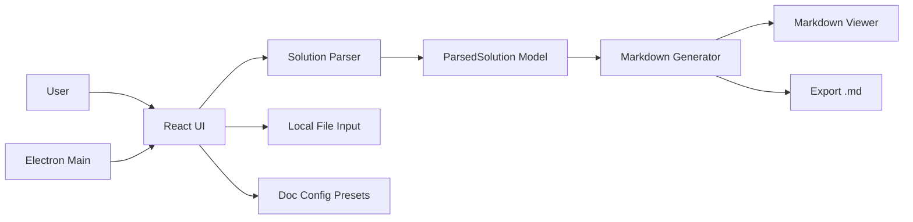
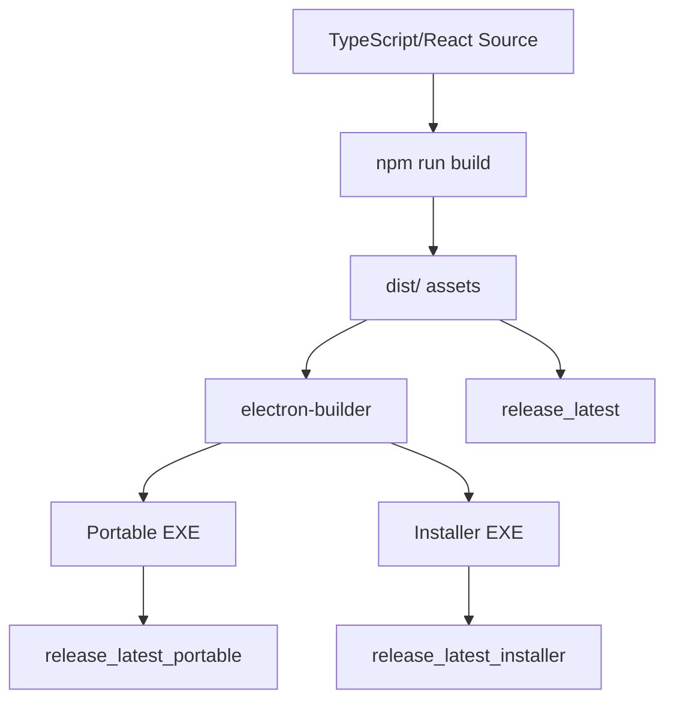

# PP-MD High-Level Design

## Overview
PP-MD is a Windows desktop documentation generator for Microsoft Power Platform solutions. The application ingests one or more solution ZIP archives, parses Dataverse and solution metadata, and generates human-readable markdown documentation with Mermaid diagrams.

## Goals
- Convert Power Platform solution content into structured technical documentation.
- Provide a desktop-first workflow for consultants and delivery teams.
- Keep generated output portable and editable as markdown.
- Preserve accessibility and security baselines in the UI/runtime.

## Architectural Style
- Client-heavy, local-processing architecture.
- Electron shell hosting a React + TypeScript renderer.
- In-process parsing and markdown generation pipeline (no backend service).
- Layered modules:
  - Presentation layer (React components and CSS modules)
  - Application orchestration layer (App.tsx)
  - Domain processing layer (solutionParser.ts, markdownGenerator.ts)
  - Packaging/runtime layer (Electron main process and build scripts)

## Context Diagram

## Major Components

### Electron Desktop Host
- main process window creation and lifecycle
- packaged-vs-dev loading behavior
- secure renderer defaults (context isolation, sandbox)
- open external links in default system browser

### React Renderer UI
- drag/drop and browse intake for solution ZIP files
- processing progress and status feedback
- multi-solution navigation and selection
- markdown view, copy, and export actions
- theme selection and persistence

### Parsing Engine
- unzips and reads solution.xml/customizations.xml and related artifacts
- normalizes varied XML schemas and label formats
- emits strongly-typed ParsedSolution object

### Markdown Engine
- transforms ParsedSolution into sectioned markdown
- creates inventory tables and process details
- emits Mermaid ERD and architecture diagrams
- supports consolidated multi-solution report generation

### Build and Packaging Pipeline
- Vite + TypeScript frontend build
- Electron Builder packaging to portable and installer targets
- post-build mirroring to latest artifact folders

## Data Flow
1. User selects one or more .zip files in the drop zone.
2. App orchestrator loops each file through parseSolutionZip.
3. ParsedSolution objects are passed to generateMarkdown.
4. Generated markdown is displayed in MarkdownViewer.
5. User exports one or more markdown files to local storage.
6. Optional consolidated markdown is generated across all loaded solutions.

## Technology Stack
- Runtime shell: Electron
- Frontend: React 18 + TypeScript + Vite
- Parsing: JSZip + fast-xml-parser
- Rendering: react-markdown + remark-gfm + Mermaid
- Packaging: electron-builder + PowerShell automation

## Security and Safety Posture
- Local-only processing of source ZIPs (no server upload path).
- CSP in index.html with restricted default sources.
- Electron security options enabled: contextIsolation and sandbox.
- External links blocked from opening new in-app windows.
- XML parser configured to avoid entity-expansion style attacks.

## Accessibility Baseline
- Keyboard-accessible controls and navigation landmarks.
- ARIA status/progress announcements.
- Contrast token checks enforced by script during build.
- Diagram source fallback to support non-visual consumption.

## Deployment View

## Operational Modes
- Development mode:
  - Vite dev server + Electron shell (desktop:dev)
  - detached dev tools enabled
- Packaged mode:
  - loads static dist/index.html
  - displays fatal load/crash error dialogs when needed

## Constraints and Assumptions
- Input format depends on Microsoft solution ZIP structure.
- Parsing logic includes defensive fallbacks due to XML shape variability.
- Diagram richness can increase markdown rendering cost on very large solutions.
- Windows-focused packaging pipeline and output naming conventions.
