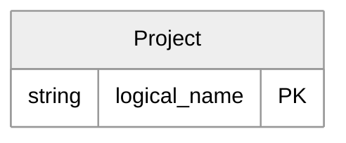

# Power Platform Solution: Contoso Core

> **Generated by PP-MD** — Power Platform Solution Documentation
> Generated on: <normalized>

## Solution Overview

- **Unique Name:** contoso_core
- **Display Name:** Contoso Core
- **Version:** 1.0.4
- **Publisher:** Contoso
- **Type:** Unmanaged

[Back to Top](#table-of-contents)

## Table of Contents

- [Entity Relationship Diagram](#entity-relationship-diagram)
- [Tables & Columns](#tables-columns)

## Entity Relationship Diagram

> ERDs use Mermaid `erDiagram` syntax with top-down layout and crow's foot relationship lines.

[Back to Top](#table-of-contents)

## Tables & Columns

### Project (new_project)

| Property | Value |
|----------|-------|
| **Logical Name** | `new_project` |
| **Ownership** | User |
| **Custom** | Yes |

#### Columns

| Display Name | Schema Name | Type | Required | Custom | Audited | Field Security | Advanced Find | Notes |
| --- | --- | --- | --- | --- | --- | --- | --- | --- |
| Name | `new_name` | String | ✅ Yes | ✳️ Yes | – | No | – |  |

---

[Back to Top](#table-of-contents)
